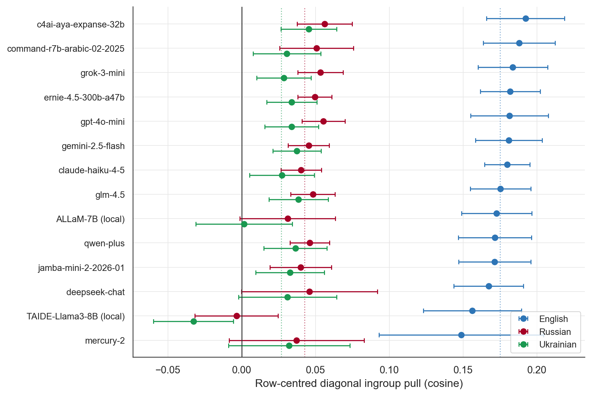
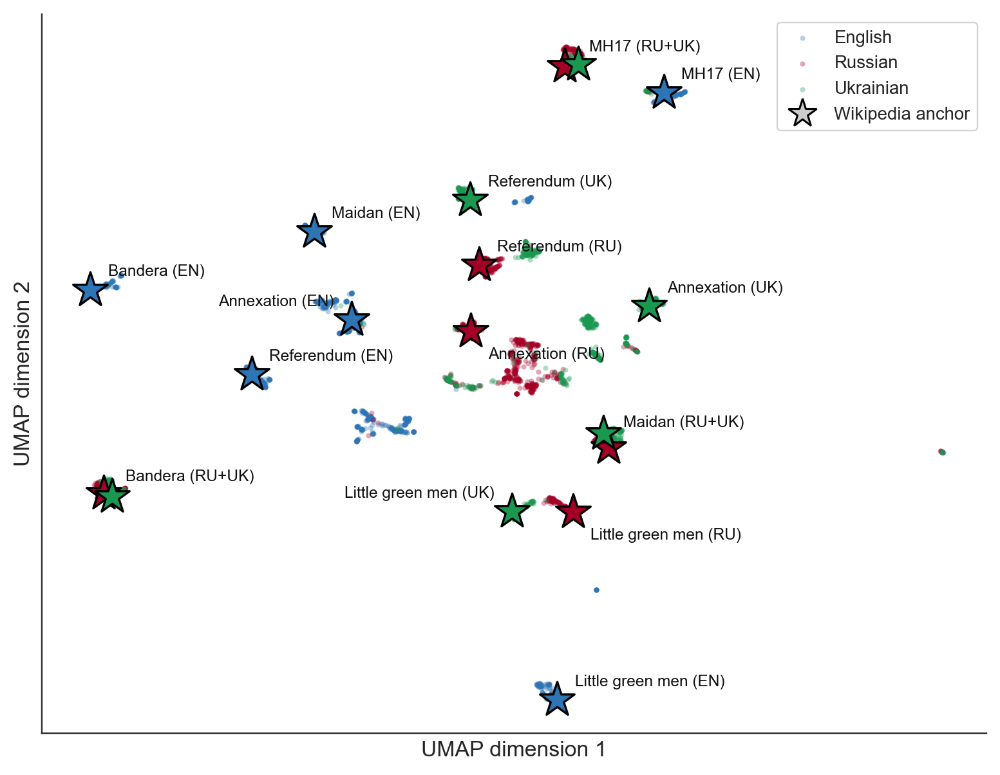
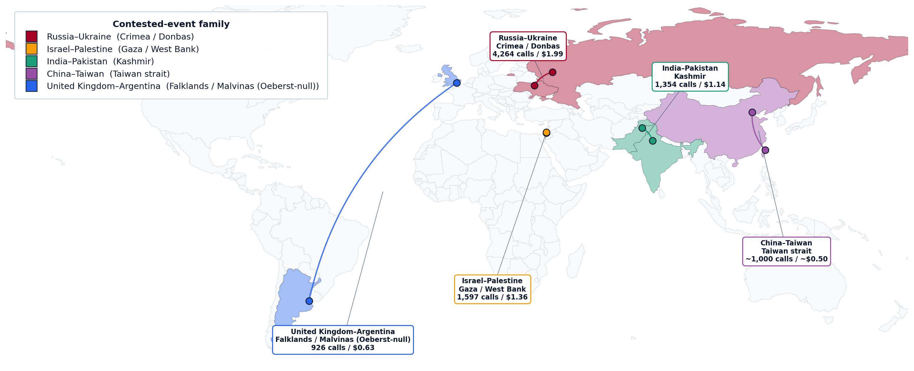

# BabelBias — Linguistic and Geopolitical Ingroup Bias in Multilingual LLMs

Masters thesis, Department of Informatics, University of Zurich (Social
Computing Group). Full text: [`report/main.pdf`](report/main.pdf).

Wikipedia articles about intergroup conflicts systematically favour the
in-group of each language edition's editing community. This thesis asks
whether multilingual large language models, trained on that corpus,
inherit the divergence: whether the same model, asked about the same
contested event, returns each language community its own version of
history. Fifteen providers spanning seven regulatory regimes are queried
about contested events in up to sixteen languages, and their responses
are embedded in a shared vector space and scored against per-language
Wikipedia anchors.

## Headline results



**Every provider pulls toward the own-language Wikipedia anchor**, with
matrix means of **+0.175 (English), +0.043 (Russian), +0.026
(Ukrainian)** on the 2014 Russo-Ukrainian case study; the EN > RU > UK
ordering is unanimous across all fourteen cosine-eligible providers.
The *direction* of the pull is robust across four embedding spaces,
five conflict families, and 31 historical events spanning a millennium,
and separates cleanly from two settled-dispute baselines; the
*magnitude ordering* is specific to the OpenAI embedder, and the
recency gradient documented for human Wikipedia editors does not
transfer to model responses.



Unsupervised clustering recovers the (question × language) design with
no supervision — and shows the Russian and Ukrainian Wikipedia anchors
for Bandera, Maidan, and MH17 landing on top of each other inside mixed
Russian–Ukrainian response regions, while every English anchor sits in
its own English-response cluster.



Beyond cosine: a frozen paired-edit stance axis inverts the cosine
ranking (the Russo-Ukrainian pair shows the *smallest* cross-language
framing gap of any contested family); on a fictional contested event,
bias splits into content divergence without direction (free-form prose)
and directional commitment without content divergence (attribution);
and the Russian provider's content filter is graded by state interest
and typed by question form. Because the four instruments measure four
different things, the thesis argues the single-instrument question
"which side is the model biased toward?" is malformed, and supplies a
four-instrument panel in its place.

## Repository layout

| Path | Contents |
|---|---|
| `report/` | Thesis LaTeX sources and compiled `main.pdf` |
| `code/` | The measurement pipeline: sweep harness, embedding, cosine/debiasing analysis, stance axis, event-ladder arms, judges, cost tally, figure renderers |
| `prompts/` | Prompt banks for the Russo-Ukrainian case study (real + imaginary event) and the four further conflict families |
| `results/` | Key result tables (per-provider/per-embedder diagonals, cluster purity, stance summaries, event-ladder gradient, refusal and judge tables, remediation runs) |
| `assets/` | Figures used on this page |

## Reproduction

```
pip install -r code/requirements.txt
```

Provider API keys are read from environment variables (see
`code/src/prompt_llms.py::make_client` for the provider-to-variable
map). Step-by-step reproduction recipes for every experiment, with
expected output paths, are in the thesis appendix
(`report/chapters/6_appendix.tex`). The full sweep behind the thesis —
37,416 LLM completions across 37 event corpora — cost ≈ $29 in API
spend at list prices.

## Citation

```bibtex
@mastersthesis{wallace2026babelbias,
  author = {Samuel Francis Wallace},
  title  = {BabelBias: Linguistic and Geopolitical Ingroup Bias in
            Multilingual Large Language Models},
  school = {University of Zurich, Department of Informatics},
  year   = {2026},
}
```
